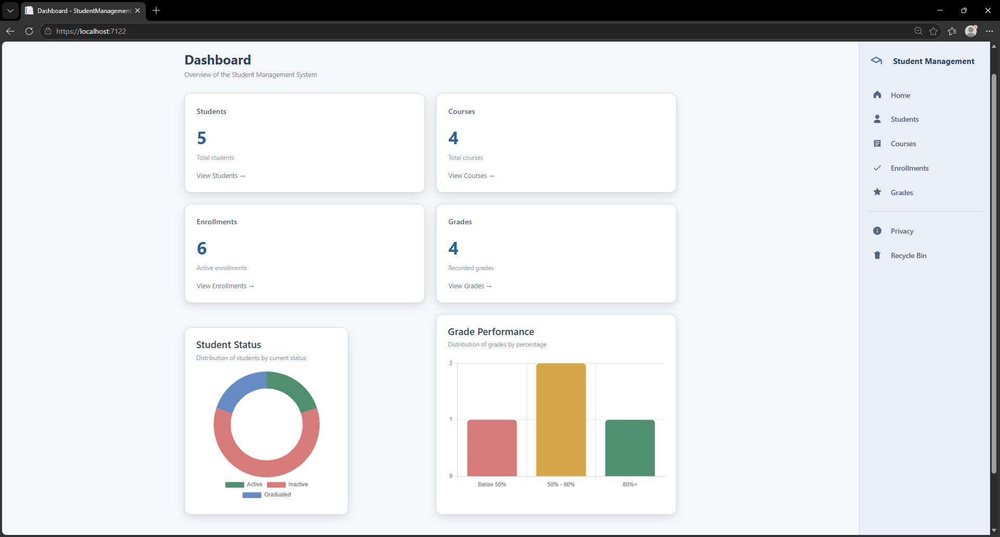
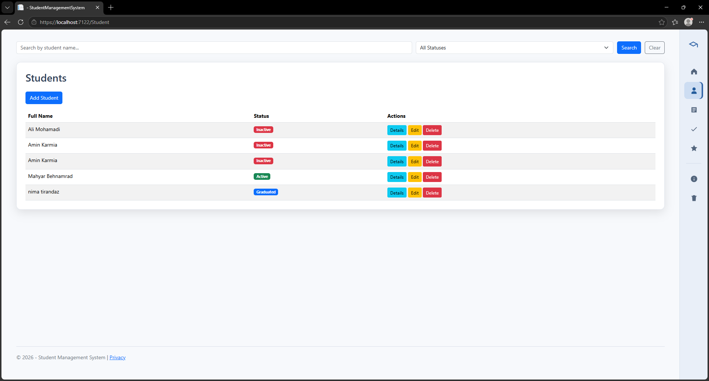
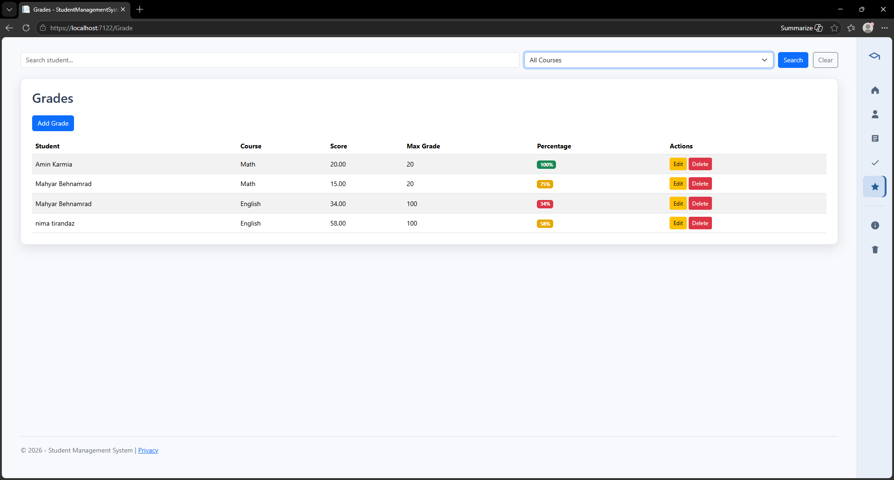
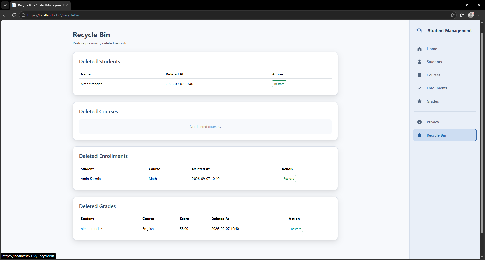

# Student Management System

A web-based Student Management System built with ASP.NET Core MVC.

This project provides a structured system for managing students, courses, enrollments, and grades. It also includes soft deletion, record restoration, dashboard analytics, search and filtering, validation, and a responsive administrative interface.

---

## Features

### Student Management
- Create students
- View student details
- Edit student information
- Soft delete students
- Search students by name
- Filter students by status
- Student statuses:
  - Active
  - Inactive
  - Graduated

### Course Management
- Create courses
- View course details
- Edit courses
- Soft delete courses
- Define a maximum grade for each course
- Search courses by name

### Enrollment Management
- Enroll students in courses
- View student-course relationships
- Search by student or course
- Prevent duplicate enrollments
- Soft delete enrollments
- Restore previously deleted enrollments

### Grade Management
- Assign grades to enrollments
- Edit grades
- Soft delete grades
- Prevent multiple active grades for the same enrollment
- Validate grades against the course maximum grade
- Automatically calculate grade percentages
- Search grades by student
- Filter grades by course
- Display performance using visual indicators

### Dashboard
- Total students
- Total courses
- Total enrollments
- Total grades
- Student status distribution
- Grade performance distribution
- Interactive charts using Chart.js

### Recycle Bin
- View deleted students
- View deleted courses
- View deleted enrollments
- View deleted grades
- Restore deleted records
- Validate related records before restoring dependent data

### User Interface
- Collapsible sidebar navigation
- Active navigation indicators
- Dashboard statistic cards
- Responsive tables and forms
- Success notifications
- Search and filtering controls
- Empty states
- Custom 404 page
- Custom application error page

---

## Technologies

- ASP.NET Core MVC
- C#
- Entity Framework Core
- SQL Server
- AutoMapper
- Razor Views
- Chart.js
- Bootstrap
- HTML
- CSS
- JavaScript
- Git
- GitHub

---

## Project Architecture

The application separates responsibilities using Controllers, Services, Interfaces, ViewModels, Entities, and Entity Framework Core.

```text
Views
  ↓
Controllers
  ↓
Service Interfaces
  ↓
Services
  ↓
Entity Framework Core
  ↓
SQL Server
```

Dedicated ViewModels are used for different application operations such as:

```text
Create
Edit
List
Details
Delete
Search / Filter
Dashboard
Recycle Bin
```

This helps keep the views focused on the data they actually require and avoids directly exposing entities to the UI.

---

## Database Structure

The main entities are:

```text
Student
Course
StudentCourse
Grade
```

### Relationships

```text
Student
   │
   │
   └──── StudentCourse ──── Course
                │
                │
              Grade
```

`StudentCourse` represents the enrollment of a student in a specific course.

Each enrollment can have one grade.

A unique constraint prevents the same student from being enrolled in the same course multiple times.

---

## Soft Delete

The application uses soft delete instead of permanently removing records.

Entities contain common audit properties:

```text
IsDeleted
DeletedAt
CreatedAt
UpdatedAt
```

Entity Framework Core Global Query Filters automatically exclude deleted records from normal queries.

Deleted records can later be viewed and restored through the Recycle Bin.

---

## Validation

Validation is performed through ViewModels and the service layer.

Examples include:

- Required student information
- Email validation
- Student and course selection validation
- Duplicate enrollment prevention
- Duplicate grade prevention
- Grade cannot be negative
- Grade cannot exceed the course maximum grade
- Related records are checked before restoration

---

## Grade Performance

Grade percentages are automatically calculated based on the course maximum grade.

Performance is grouped into:

```text
Below 50%  → Low
50% - 80%  → Medium
80%+        → High
```

The application uses visual indicators and dashboard charts to represent these performance levels.

---

## Screenshots

### Dashboard



The dashboard provides an overview of students, courses, enrollments, and grades, along with student status and grade performance charts.

---

### Students



Students can be searched by name and filtered by status.

---

### Grades



Grades can be searched by student, filtered by course, and visually categorized based on percentage.

---

### Recycle Bin



Soft-deleted records can be reviewed and restored from the Recycle Bin.

---

## Getting Started

### 1. Clone the repository

```bash
git clone https://github.com/mahyarbehnamrad/StudentManagementSystem.git
```

### 2. Navigate to the project

```bash
cd StudentManagementSystem
```

### 3. Restore dependencies

```bash
dotnet restore
```

### 4. Configure the database

Update the connection string inside:

```text
StudentManagementSystem/appsettings.json
```

to match your SQL Server environment.

### 5. Apply database migrations

```bash
dotnet ef database update --project StudentManagementSystem
```

### 6. Run the application

```bash
dotnet run --project StudentManagementSystem
```

---

## Possible Future Improvements

- Authentication and authorization
- Role-based access control
- Automated testing
- Pagination for large datasets
- Additional reports and analytics

---

## Privacy

This project is intended for educational and portfolio demonstration purposes.

Do not enter real or sensitive personal information when using the application for demonstration purposes.

---

## Author

**Mahyar Behnamrad**

GitHub: [mahyarbehnamrad](https://github.com/mahyarbehnamrad)
